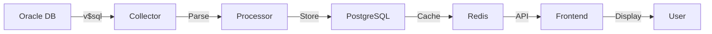
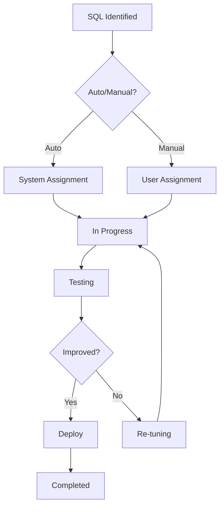
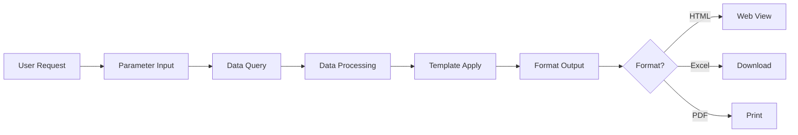

# 🗂️ Information Architecture (IA) - Continued
## Oracle 튜닝관리시스템 TMS v2.0

---

## 11. 컨텐츠 전략

### 11.1 컨텐츠 유형

#### 정적 컨텐츠
- **도움말 문서**: 기능별 사용 가이드
- **튜닝 가이드**: Best Practice 문서
- **FAQ**: 자주 묻는 질문
- **용어 사전**: 기술 용어 정의

#### 동적 컨텐츠
- **실시간 메트릭**: 5초 주기 갱신
- **SQL 목록**: 실시간 업데이트
- **알림 메시지**: 즉시 전달
- **차트/그래프**: 동적 렌더링

#### 생성형 컨텐츠
- **AWR 리포트**: 사용자 요청시 생성
- **튜닝 리포트**: 작업 완료시 생성
- **분석 리포트**: 주기적 자동 생성

### 11.2 컨텐츠 수명 주기

```
생성 → 검토 → 게시 → 유지보수 → 보관 → 폐기

- 실시간 데이터: 24시간
- 일일 데이터: 7일
- 주간 데이터: 4주
- 월간 데이터: 12개월
- 튜닝 이력: 영구 보관
```

### 11.3 컨텐츠 거버넌스

| 컨텐츠 유형 | 생성 주체 | 검토 주체 | 보관 기간 | 접근 권한 |
|------------|-----------|-----------|-----------|-----------|
| SQL 성능 데이터 | System | Auto | 90일 | All Users |
| 튜닝 이력 | Tuner | Admin | 영구 | Tuner+ |
| AWR 리포트 | System/User | Auto | 30일 | DBA |
| 시스템 로그 | System | Admin | 1년 | Admin |

---

## 12. 라벨링 시스템

### 12.1 네이밍 컨벤션

#### 메뉴 라벨
```
- 명사형 사용: "SQL 모니터링" (O) vs "SQL을 모니터링하기" (X)
- 2-3 단어 이내: "Top SQL" (O) vs "가장 많이 사용되는 SQL 목록" (X)
- 일관된 용어: "조회" 사용시 모든 곳에서 "조회" 사용
```

#### 버튼 라벨
```
- 동사형 사용: "조회", "저장", "삭제"
- 액션 명확화: "SQL 등록" vs 단순 "등록"
- 긍정형 우선: "저장" vs "저장 안 함"
```

#### 상태 라벨
```
- 명확한 구분: "진행중" / "완료" / "대기"
- 색상과 연계: 빨강(Critical), 노랑(Warning), 초록(Normal)
- 아이콘 병용: 🔴 Critical, 🟡 Warning, 🟢 Normal
```

### 12.2 용어 표준화

| 영문 | 한글 표준 | 약어 | 설명 |
|------|-----------|------|------|
| Buffer Gets | 버퍼 읽기 | BG | 메모리에서 읽은 블록 수 |
| Elapsed Time | 수행 시간 | ET | SQL 실행 총 소요 시간 |
| Execution | 실행 횟수 | EXEC | SQL 실행 횟수 |
| Parse | 파싱 | - | SQL 구문 분석 |
| Bind Variable | 바인드 변수 | BV | SQL 파라미터 |
| Wait Event | 대기 이벤트 | WE | 대기 발생 이벤트 |
| Session | 세션 | SID | 데이터베이스 연결 |

### 12.3 다국어 지원

```json
{
  "ko": {
    "menu.monitoring": "SQL 모니터링",
    "button.search": "조회",
    "label.status": "상태",
    "message.success": "성공적으로 처리되었습니다"
  },
  "en": {
    "menu.monitoring": "SQL Monitoring",
    "button.search": "Search",
    "label.status": "Status",
    "message.success": "Successfully processed"
  }
}
```

---

## 13. 검색 시스템 상세

### 13.1 검색 아키텍처

```
┌─────────────────────────────────────────────────────────┐
│                    Search Interface                      │
├─────────────┬────────────────┬──────────────────────────┤
│ Quick Search│ Advanced Search│ SQL Full Text Search     │
└──────┬──────┴────────┬───────┴────────┬─────────────────┘
       │               │                │
       ▼               ▼                ▼
┌──────────────────────────────────────────────────────┐
│              Search Engine (Elasticsearch)            │
├──────────────┬─────────────┬─────────────────────────┤
│   Indexing   │   Ranking   │   Faceting              │
└──────────────┴─────────────┴─────────────────────────┘
```

### 13.2 검색 인덱싱 전략

#### 인덱스 구조
```json
{
  "sql_index": {
    "sql_id": "keyword",
    "sql_text": "text",
    "module": "keyword",
    "schema": "keyword",
    "metrics": {
      "elapsed_time": "long",
      "buffer_gets": "long",
      "cpu_time": "long"
    },
    "timestamp": "date"
  }
}
```

#### 검색 가중치
- SQL ID: 10
- Module: 8
- SQL Text: 6
- Schema: 4
- Comments: 2

### 13.3 검색 결과 표시

#### 결과 그룹핑
```
검색 결과 (총 145건)

[SQL 문장] (89건)
- SQL ID: abc123def456
- Module: HR_APP
- Elapsed Time: 1,234ms

[튜닝 이력] (34건)
- 튜닝 일자: 2025-01-07
- 개선율: 67%

[리포트] (22건)
- AWR Report: 2025-01-08
- 생성자: admin
```

#### 검색 필터 (Facets)
```
□ 기간
  □ 오늘 (23)
  □ 최근 7일 (145)
  □ 최근 30일 (523)

□ 모듈
  □ HR_APP (45)
  □ SALES_RPT (38)
  □ BATCH_JOB (22)

□ 상태
  □ Critical (12)
  □ Warning (34)
  □ Normal (99)
```

---

## 14. 네비게이션 시스템 상세

### 14.1 네비게이션 패턴

#### Global Navigation
```
항상 표시 | 고정 위치 | 주요 섹션 접근
```

#### Local Navigation
```
컨텍스트 의존 | 좌측 배치 | 섹션 내 이동
```

#### Breadcrumb Navigation
```
경로 표시 | 상위 이동 | 현재 위치 확인
```

#### Contextual Navigation
```
관련 링크 | 다음 액션 | 추천 경로
```

### 14.2 메뉴 깊이 제한

```
Level 0: Home
Level 1: Main Category (6개)
Level 2: Sub Category (5개 이내)
Level 3: Function Page (직접 기능)
```

### 14.3 네비게이션 상태

```css
/* 기본 상태 */
.nav-item { 
  color: #333; 
  background: transparent; 
}

/* 호버 상태 */
.nav-item:hover { 
  color: #007bff; 
  background: #f0f0f0; 
}

/* 활성 상태 */
.nav-item.active { 
  color: #fff; 
  background: #007bff; 
}

/* 비활성 상태 */
.nav-item:disabled { 
  color: #999; 
  opacity: 0.5; 
}
```

---

## 15. 조직화 체계

### 15.1 분류 체계 (Taxonomy)

#### 계층적 분류
```
SQL 성능
├── 시간 메트릭
│   ├── Elapsed Time
│   ├── CPU Time
│   └── Wait Time
├── I/O 메트릭
│   ├── Buffer Gets
│   ├── Disk Reads
│   └── Physical Writes
└── 실행 메트릭
    ├── Executions
    ├── Parse Calls
    └── Fetches
```

#### 패싯 분류
```
SQL을 여러 차원으로 분류:
- By Performance: High/Medium/Low
- By Module: HR/Sales/Finance
- By Status: Active/Inactive
- By Priority: Critical/Normal
```

### 15.2 메타데이터 체계

#### 필수 메타데이터
```yaml
sql_metadata:
  - sql_id: required, unique
  - creation_date: required, auto
  - last_modified: required, auto
  - status: required, enum
  - priority: required, enum
```

#### 선택 메타데이터
```yaml
optional_metadata:
  - tags: array
  - notes: text
  - attachments: array
  - related_sql: array
```

### 15.3 태깅 시스템

#### 자동 태그
- Performance: `#slow`, `#fast`, `#optimal`
- Resource: `#high-cpu`, `#high-io`, `#high-memory`
- Time: `#peak-time`, `#batch-window`

#### 사용자 태그
- Custom: `#todo`, `#review`, `#urgent`
- Project: `#project-a`, `#migration`
- Team: `#team-dba`, `#team-dev`

---

## 16. 와이어프레임 상세

### 16.1 대시보드 와이어프레임

```
┌──────────────────────────────────────────────────────────┐
│ [Logo] Oracle TMS          [User] [Notifications] [Logout]│
├──────────────────────────────────────────────────────────┤
│ Dashboard | SQL Monitoring | Tuning | Trace | AWR | Config│
├──────────────────────────────────────────────────────────┤
│                                                           │
│  ┌─────────┐ ┌─────────┐ ┌─────────┐ ┌─────────┐ ┌─────────┐
│  │ 89.2%   │ │ 1,234   │ │ 45ms    │ │ 2.3GB   │ │ 156     │
│  │ Buffer  │ │ Exec/s  │ │ Avg Resp│ │ SGA Used│ │ Sessions│
│  └─────────┘ └─────────┘ └─────────┘ └─────────┘ └─────────┘
│                                                           │
│  ┌───────────────────────────┐ ┌───────────────────────┐ │
│  │      Top SQL Chart         │ │    Wait Event Chart   │ │
│  │      [Bar Graph]           │ │    [Pie Chart]        │ │
│  └───────────────────────────┘ └───────────────────────┘ │
│                                                           │
│  ┌─────────────────────────────────────────────────────┐ │
│  │ Recent Alerts                                       │ │
│  │ • [Critical] SQL abc123 exceeded threshold         │ │
│  │ • [Warning] Buffer cache hit ratio dropped         │ │
│  │ • [Info] AWR snapshot completed                    │ │
│  └─────────────────────────────────────────────────────┘ │
└──────────────────────────────────────────────────────────┘
```

### 16.2 SQL 목록 와이어프레임

```
┌──────────────────────────────────────────────────────────┐
│ SQL Monitoring > Top SQL                                 │
├──────────────────────────────────────────────────────────┤
│ Search Panel                                             │
│ ┌──────────┐ ┌──────────┐ ┌──────────┐ ┌──────────┐    │
│ │SQL ID:___│ │Module:▼  │ │From:_____│ │To:_______│    │
│ └──────────┘ └──────────┘ └──────────┘ └──────────┘    │
│ [Search] [Reset] [Export]                                │
├──────────────────────────────────────────────────────────┤
│ Results: 145 SQLs found          [□] Select All          │
│ ┌─────────────────────────────────────────────────────┐ │
│ │Rank│SQL ID      │Module│Elapsed│Buffer│Status      │ │
│ ├────┼────────────┼──────┼───────┼──────┼────────────┤ │
│ │ 1  │abc123def   │HR_APP│1,234ms│523K  │[Critical]  │ │
│ │ 2  │xyz789ghi   │SALES │  987ms│412K  │[Warning]   │ │
│ │ 3  │lmn456opq   │BATCH │  654ms│298K  │[Normal]    │ │
│ └─────────────────────────────────────────────────────┘ │
│ [◀] [1] [2] [3] ... [10] [▶]     Showing 1-20 of 145   │
└──────────────────────────────────────────────────────────┘
```

---

## 17. 사용자 시나리오

### 17.1 시나리오 1: 긴급 성능 이슈 대응

```
GIVEN: DBA가 성능 알림을 받음
WHEN: 시스템에 로그인
THEN: 대시보드에서 Critical SQL 확인

WHEN: Critical SQL 클릭
THEN: SQL 상세 정보 표시

WHEN: 실행계획 조회
THEN: Full Table Scan 발견

WHEN: 튜닝 대상 등록
THEN: 튜닝 워크플로우 시작

WHEN: Index 생성 후 재실행
THEN: 성능 90% 개선 확인
```

### 17.2 시나리오 2: 정기 성능 리뷰

```
GIVEN: 매주 월요일 성능 리뷰
WHEN: AWR Report 생성
THEN: 주간 성능 트렌드 확인

WHEN: Top SQL 분석
THEN: 개선 대상 SQL 식별

WHEN: 튜닝 이력 조회
THEN: 반복 문제 SQL 확인

WHEN: 튜닝 계획 수립
THEN: 튜닝 작업 할당
```

### 17.3 시나리오 3: 신규 SQL 모니터링

```
GIVEN: 신규 애플리케이션 배포
WHEN: 모니터링 설정 추가
THEN: 신규 Module 모니터링 시작

WHEN: 첫 실행 SQL 감지
THEN: Baseline 성능 기록

WHEN: 임계값 초과 발생
THEN: 자동 알림 발송

WHEN: 튜너 확인
THEN: 즉시 튜닝 작업 시작
```

---

## 18. 정보 흐름도

### 18.1 데이터 수집 흐름



### 18.2 튜닝 워크플로우



### 18.3 리포트 생성 흐름



---

## 19. 카드 소팅 결과

### 19.1 Open Card Sorting 결과

사용자 그룹별 분류 결과:

#### DBA 그룹 분류
```
성능 모니터링
├── 실시간 SQL
├── Top SQL
├── Wait Events
└── Sessions

튜닝 작업
├── 튜닝 대상
├── 실행계획
├── 튜닝 이력
└── 결과 분석

시스템 관리
├── AWR/ADDM
├── Trace
├── 설정
└── 사용자
```

#### Developer 그룹 분류
```
SQL 분석
├── 내 SQL
├── 느린 SQL
├── 실행계획
└── 인덱스

성능 개선
├── 튜닝 요청
├── 튜닝 결과
└── Best Practice

리포트
├── 일일 리포트
├── 성능 트렌드
└── 개선 현황
```

### 19.2 Closed Card Sorting 검증

| 기능 | 예상 위치 | 실제 배치 | 일치율 |
|------|----------|----------|--------|
| SQL 검색 | SQL 모니터링 | SQL 모니터링 | 95% |
| 실행계획 | 실행계획 | 실행계획 | 88% |
| AWR 리포트 | AWR/ADDM | AWR/ADDM | 92% |
| 튜닝 이력 | 튜닝 관리 | 튜닝 관리 | 90% |

---

## 20. 접근성 가이드라인

### 20.1 WCAG 2.1 준수

#### Level A (필수)
- 모든 이미지에 대체 텍스트
- 키보드로 모든 기능 접근
- 시간 제한 조정 가능
- 명확한 페이지 제목

#### Level AA (권장)
- 색상 대비 4.5:1 이상
- 텍스트 크기 조절 200%
- 일관된 네비게이션
- 오류 식별 및 설명

### 20.2 키보드 네비게이션

```
Tab: 다음 요소로 이동
Shift+Tab: 이전 요소로 이동
Enter: 선택/실행
Space: 체크박스 토글
Esc: 모달/팝업 닫기
Arrow Keys: 메뉴/리스트 탐색
Ctrl+S: 저장
Ctrl+F: 검색
```

### 20.3 스크린 리더 지원

```html
<!-- ARIA Labels -->
<button aria-label="SQL 검색">검색</button>
<div role="alert" aria-live="polite">검색 완료</div>
<nav aria-label="주 메뉴">...</nav>

<!-- Semantic HTML -->
<main>주요 컨텐츠</main>
<aside>보조 정보</aside>
<article>독립적 컨텐츠</article>
```

---

## 21. 모바일 정보 구조

### 21.1 반응형 브레이크포인트

```css
/* Mobile First Approach */
/* Mobile: 0-767px */
/* Tablet: 768px-1023px */
/* Desktop: 1024px+ */
```

### 21.2 모바일 네비게이션

```
┌──────────────────┐
│ ☰  TMS    🔔  👤 │  <- Hamburger Menu
├──────────────────┤
│                  │
│   Dashboard      │  <- Single Column
│                  │
│  [Metric Card]   │
│  [Metric Card]   │
│  [Metric Card]   │
│                  │
│  [Chart Area]    │
│                  │
│  [SQL List]      │
│   ┌──────────┐   │
│   │ SQL 1    │   │  <- Card Layout
│   └──────────┘   │
│   ┌──────────┐   │
│   │ SQL 2    │   │
│   └──────────┘   │
└──────────────────┘
```

### 21.3 터치 인터랙션

- **Swipe Left/Right**: 탭 전환
- **Pull to Refresh**: 데이터 새로고침
- **Long Press**: 컨텍스트 메뉴
- **Pinch Zoom**: 차트 확대/축소
- **Double Tap**: 상세 보기

---

## 22. 정보 보안 및 권한

### 22.1 정보 접근 권한 매트릭스

| 정보 유형 | Admin | DBA | Tuner | Developer | Viewer |
|----------|-------|-----|-------|-----------|--------|
| SQL 모니터링 | ✓ | ✓ | ✓ | ✓ | ✓ |
| 튜닝 작업 | ✓ | ✓ | ✓ | △ | ✗ |
| AWR/ADDM | ✓ | ✓ | △ | ✗ | ✗ |
| 시스템 설정 | ✓ | △ | ✗ | ✗ | ✗ |
| 사용자 관리 | ✓ | ✗ | ✗ | ✗ | ✗ |

✓: 전체 권한, △: 제한적 권한, ✗: 접근 불가

### 22.2 민감 정보 처리

#### 마스킹 규칙
```sql
-- 원본
SELECT * FROM employees WHERE ssn = '123-45-6789';

-- 마스킹
SELECT * FROM employees WHERE ssn = '***-**-6789';
```

#### 로깅 제외 항목
- 비밀번호
- 개인정보 (주민번호, 카드번호)
- 바인드 변수 값
- 민감 테이블 데이터

---

## 23. 성능 최적화 전략

### 23.1 정보 로딩 전략

#### Lazy Loading
```javascript
// 스크롤시 추가 데이터 로드
const loadMore = () => {
  if (scrolledToBottom()) {
    fetchNextPage();
  }
};
```

#### Progressive Loading
```
1단계: 핵심 메트릭 (< 1초)
2단계: 차트/그래프 (< 3초)  
3단계: 상세 데이터 (< 5초)
```

### 23.2 캐싱 전략

| 데이터 유형 | 캐시 TTL | 캐시 위치 | 갱신 전략 |
|------------|----------|-----------|-----------|
| 실시간 메트릭 | 5초 | Memory | Auto Refresh |
| SQL 목록 | 1분 | Redis | On Demand |
| 실행계획 | 10분 | Browser | Manual |
| 리포트 | 1시간 | CDN | Scheduled |

---

## 24. 정보 아키텍처 검증

### 24.1 Usability Testing 계획

#### 태스크 시나리오
1. Critical SQL 찾아서 튜닝 등록하기
2. 어제 실행된 Top 10 SQL 조회하기
3. 특정 모듈의 성능 트렌드 분석하기
4. AWR 리포트 생성하고 다운로드하기

#### 성공 지표
- Task Completion Rate > 90%
- Error Rate < 5%
- Time on Task < 목표 시간
- SUS Score > 70

### 24.2 A/B Testing 항목

```javascript
// Variant A: 트리 메뉴
navigation: 'tree-menu'

// Variant B: 메가 메뉴  
navigation: 'mega-menu'

// 측정 지표
- Click-through Rate
- Time to Complete
- User Preference
```

### 24.3 Analytics 추적

```javascript
// 페이지뷰 추적
gtag('event', 'page_view', {
  page_title: 'SQL Monitoring',
  page_path: '/sql/monitoring'
});

// 사용자 행동 추적
gtag('event', 'sql_search', {
  search_term: 'buffer gets > 10000',
  results_count: 45
});
```

---

## 25. 향후 확장 계획

### 25.1 Phase 2 기능

- **AI 기반 튜닝 제안**: ML 모델을 통한 자동 튜닝 추천
- **예측 분석**: 성능 저하 사전 예측
- **자동화 확대**: 튜닝 작업 자동 실행
- **Multi-DB 지원**: MySQL, PostgreSQL 확장

### 25.2 정보 구조 확장 고려사항

```
현재 구조 (Single DB)
└── Oracle Instance
    └── SQL Monitoring

확장 구조 (Multi DB)
├── Oracle Instances
│   ├── Instance 1
│   └── Instance 2
├── MySQL Instances
└── PostgreSQL Instances
```

### 25.3 국제화 준비

- URL 구조: `/ko/sql/monitoring`
- 언어 전환: Header 우측 상단
- 날짜/시간: 로케일별 포맷
- 숫자 포맷: 지역별 구분자

---

*문서 버전: 1.0 (Extended)*  
*작성일: 2025-01-08*  
*작성자: TMS Development Team*  
*검토자: Information Architecture Team*
