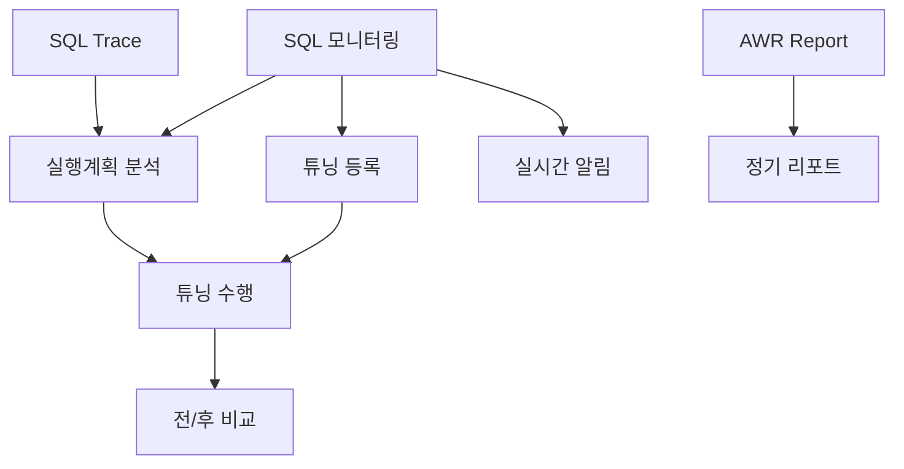

# 📘 Use Case Document
## Oracle 튜닝관리시스템 TMS v2.0

---

## 1. Use Case 개요

### 1.1 문서 목적
본 문서는 Oracle 튜닝관리시스템(TMS)의 주요 사용 사례를 정의하고, 각 액터(Actor)별 시스템 상호작용을 명세화합니다.

### 1.2 시스템 경계
```
┌──────────────────────────────────────────────────┐
│              TMS System Boundary                  │
│                                                   │
│  ┌──────────┐  ┌──────────┐  ┌──────────┐      │
│  │   SQL    │  │  Tuning  │  │ Reporting│      │
│  │Monitoring│  │Management│  │  System  │      │
│  └──────────┘  └──────────┘  └──────────┘      │
│                                                   │
│  ┌──────────┐  ┌──────────┐  ┌──────────┐      │
│  │   AWR/   │  │   SQL    │  │  System  │      │
│  │   ADDM   │  │  Trace   │  │  Config  │      │
│  └──────────┘  └──────────┘  └──────────┘      │
└──────────────────────────────────────────────────┘
```

### 1.3 액터 정의

| 액터 | 설명 | 권한 레벨 |
|------|------|-----------|
| **DBA** | 데이터베이스 관리자 | Full Access |
| **SQL Tuner** | SQL 튜닝 전문가 | Tuning Operations |
| **Developer** | 애플리케이션 개발자 | Read & Request |
| **Manager** | IT 관리자 | Reports & Overview |
| **System** | 자동화 프로세스 | Automated Tasks |
| **Scheduler** | 스케줄링 시스템 | Scheduled Jobs |

---

## 2. Primary Use Cases

### UC001: SQL 성능 모니터링

**액터**: DBA, SQL Tuner, Developer  
**우선순위**: Critical  
**빈도**: 매일 수십 회

#### 기본 흐름 (Basic Flow)
1. 사용자가 시스템에 로그인한다
2. 시스템이 대시보드를 표시한다
3. 사용자가 SQL 모니터링 메뉴를 선택한다
4. 시스템이 실시간 SQL 목록을 표시한다
5. 사용자가 정렬/필터 조건을 설정한다
6. 시스템이 조건에 맞는 SQL을 표시한다
7. 사용자가 특정 SQL을 선택한다
8. 시스템이 SQL 상세 정보를 표시한다

#### 대안 흐름 (Alternative Flow)
- **3a.** 사용자가 검색 조건을 입력한다
  - 3a1. 시스템이 검색 결과를 표시한다
- **7a.** SQL이 임계값을 초과한다
  - 7a1. 시스템이 경고를 표시한다
  - 7a2. 시스템이 자동으로 튜닝 대상으로 등록한다

#### 예외 흐름 (Exception Flow)
- **E1.** 데이터베이스 연결 실패
  - 시스템이 오류 메시지를 표시한다
  - 시스템이 재연결을 시도한다

#### 사전 조건 (Preconditions)
- 사용자가 인증되어 있어야 함
- Oracle 데이터베이스가 실행 중이어야 함

#### 사후 조건 (Postconditions)
- SQL 조회 이력이 기록됨
- 문제 SQL이 식별됨

#### UI 목업
```
┌─────────────────────────────────────┐
│ SQL 모니터링 > 실시간              │
├─────────────────────────────────────┤
│ [검색] SQL ID: [____] Module: [▼]  │
├─────────────────────────────────────┤
│ SQL ID  | Module | Elapsed | Buffer│
│ abc123  | HR_APP | 1234ms  | 523K  │
│ def456  | SALES  | 987ms   | 412K  │
└─────────────────────────────────────┘
```

---

### UC002: 튜닝 대상 SQL 등록

**액터**: DBA, SQL Tuner  
**우선순위**: Critical  
**빈도**: 매일 10-20회

#### 기본 흐름
1. 사용자가 문제 SQL을 식별한다
2. 사용자가 "튜닝 등록" 버튼을 클릭한다
3. 시스템이 등록 폼을 표시한다
4. 사용자가 튜닝 정보를 입력한다
   - 우선순위 (Critical/High/Medium/Low)
   - 튜닝 사유
   - 목표 개선율
   - 담당자 지정
5. 사용자가 저장 버튼을 클릭한다
6. 시스템이 튜닝 요청을 저장한다
7. 시스템이 담당자에게 알림을 발송한다
8. 시스템이 확인 메시지를 표시한다

#### 대안 흐름
- **1a.** 시스템이 자동으로 문제 SQL을 감지한다
  - 1a1. 시스템이 자동 등록 프로세스를 실행한다
- **4a.** 사용자가 기존 튜닝 이력을 참조한다
  - 4a1. 시스템이 유사 SQL 튜닝 이력을 표시한다

#### 비즈니스 규칙
- Critical 우선순위는 24시간 내 처리
- 동일 SQL은 중복 등록 불가
- 튜닝 담당자는 Tuner 권한 필요

#### 입력 데이터
```json
{
  "sql_id": "abc123def456",
  "priority": "Critical",
  "reason": "High buffer gets causing performance degradation",
  "target_improvement": 50,
  "assigned_to": "tuner01",
  "due_date": "2025-01-10"
}
```

---

### UC003: 실행계획 분석

**액터**: DBA, SQL Tuner, Developer  
**우선순위**: High  
**빈도**: 매일 30-50회

#### 기본 흐름
1. 사용자가 SQL 상세 페이지에 접근한다
2. 사용자가 "실행계획" 탭을 선택한다
3. 시스템이 현재 실행계획을 조회한다
4. 시스템이 트리 구조로 실행계획을 표시한다
5. 사용자가 각 단계별 상세 정보를 확인한다
6. 사용자가 문제점을 식별한다
7. 사용자가 튜닝 방안을 수립한다

#### 대안 흐름
- **3a.** 여러 실행계획이 존재한다
  - 3a1. 시스템이 계획 목록을 표시한다
  - 3a2. 사용자가 비교할 계획을 선택한다
- **5a.** 사용자가 통계 정보를 확인한다
  - 5a1. 시스템이 테이블/인덱스 통계를 표시한다

#### 시스템 상호작용
```sequence
User -> System: Request Execution Plan
System -> Oracle: EXPLAIN PLAN FOR SELECT...
Oracle -> System: Return Plan
System -> User: Display Tree Structure
User -> System: Analyze Cost
System -> User: Highlight Issues
```

---

### UC004: AWR Report 생성

**액터**: DBA, Manager  
**우선순위**: High  
**빈도**: 일일/주간

#### 기본 흐름
1. 사용자가 AWR/ADDM 메뉴를 선택한다
2. 사용자가 "AWR Report 생성"을 클릭한다
3. 시스템이 스냅샷 목록을 표시한다
4. 사용자가 시작/종료 스냅샷을 선택한다
5. 사용자가 리포트 형식을 선택한다 (HTML/Text)
6. 사용자가 생성 버튼을 클릭한다
7. 시스템이 AWR Report를 생성한다
8. 시스템이 리포트를 표시한다
9. 사용자가 리포트를 다운로드한다

#### 대안 흐름
- **4a.** 사용자가 시간 범위를 직접 입력한다
- **7a.** 리포트 생성이 오래 걸린다
  - 7a1. 시스템이 진행 상태를 표시한다
  - 7a2. 시스템이 백그라운드 생성 옵션을 제공한다

#### 사후 조건
- AWR Report가 저장됨
- 리포트 생성 이력이 기록됨

---

### UC005: 튜닝 작업 수행

**액터**: SQL Tuner  
**우선순위**: Critical  
**빈도**: 매일 5-10회

#### 기본 흐름
1. 튜너가 할당된 SQL 목록을 조회한다
2. 튜너가 튜닝 대상 SQL을 선택한다
3. 시스템이 SQL 상세 정보를 표시한다
4. 튜너가 현재 성능 메트릭을 기록한다
5. 튜너가 실행계획을 분석한다
6. 튜너가 튜닝 방법을 결정한다
   - Index 생성/삭제
   - SQL 재작성
   - 힌트 추가
   - 통계정보 갱신
7. 튜너가 튜닝을 적용한다
8. 튜너가 개선된 성능을 측정한다
9. 시스템이 튜닝 전/후를 비교한다
10. 튜너가 튜닝 결과를 저장한다

#### 상태 전이
```
Assigned → In Progress → Testing → Review → Completed
                ↓           ↓
            Failed      Rejected → In Progress
```

#### 튜닝 체크리스트
- [ ] 실행계획 분석 완료
- [ ] 인덱스 사용 검토
- [ ] 조인 순서 최적화
- [ ] 통계정보 최신화
- [ ] 파티셔닝 검토
- [ ] SQL 재작성 검토

---

### UC006: 실시간 알림 처리

**액터**: System, DBA  
**우선순위**: High  
**빈도**: 시간당 수십 회

#### 기본 흐름
1. 시스템이 성능 메트릭을 모니터링한다
2. 시스템이 임계값 초과를 감지한다
3. 시스템이 알림 규칙을 확인한다
4. 시스템이 알림 메시지를 생성한다
5. 시스템이 알림을 발송한다
   - Dashboard 알림
   - Email 발송
   - SMS 발송 (Critical only)
6. 시스템이 알림 이력을 기록한다
7. DBA가 알림을 확인한다
8. DBA가 조치를 수행한다

#### 알림 조건
```yaml
critical_alerts:
  - elapsed_time > 10000ms
  - buffer_gets > 1000000
  - cpu_usage > 90%
  
warning_alerts:
  - elapsed_time > 5000ms
  - buffer_gets > 500000
  - cpu_usage > 70%
```

---

## 3. Secondary Use Cases

### UC007: SQL Trace 설정

**액터**: DBA  
**우선순위**: Medium  
**빈도**: 주 2-3회

#### 기본 흐름
1. DBA가 SQL Trace 메뉴를 선택한다
2. DBA가 Trace 대상을 선택한다 (Session/System)
3. DBA가 Trace Level을 설정한다
4. DBA가 Trace를 활성화한다
5. 시스템이 Trace 파일을 생성한다
6. DBA가 Trace를 비활성화한다
7. 시스템이 TKPROF를 실행한다
8. DBA가 분석 결과를 확인한다

---

### UC008: 정기 리포트 생성

**액터**: Scheduler, Manager  
**우선순위**: Medium  
**빈도**: Daily/Weekly/Monthly

#### 기본 흐름
1. 스케줄러가 정기 작업을 트리거한다
2. 시스템이 리포트 템플릿을 로드한다
3. 시스템이 데이터를 수집한다
4. 시스템이 리포트를 생성한다
5. 시스템이 리포트를 저장한다
6. 시스템이 이메일로 발송한다

#### 리포트 유형
- 일일 성능 요약
- 주간 튜닝 현황
- 월간 개선 보고서

---

### UC009: 사용자 권한 관리

**액터**: Admin  
**우선순위**: Low  
**빈도**: 월 1-2회

#### 기본 흐름
1. Admin이 사용자 관리 메뉴를 선택한다
2. Admin이 사용자를 검색한다
3. Admin이 권한을 수정한다
4. 시스템이 권한을 검증한다
5. 시스템이 변경사항을 저장한다
6. 시스템이 감사 로그를 기록한다

---

## 4. Use Case 다이어그램

```
                    TMS System
     ┌──────────────────────────────────────┐
     │                                      │
     │  [SQL Monitoring]──────[View SQL]    │
     │         │                            │
     │         └────[Search SQL]            │
     │                                      │
DBA──┼──[Tuning Management]──[Register SQL] │
     │         │                            │
     │         └────[Perform Tuning]        │
     │                                      │
Tuner┼──[Execution Plan]────[Analyze Plan]  │
     │         │                            │
     │         └────[Compare Plans]         │
     │                                      │
Dev──┼──[Reports]───────────[Generate Report]│
     │                                      │
     │  [AWR/ADDM]──────────[Create AWR]    │
     │                                      │
     └──────────────────────────────────────┘
                    ▲
                    │
                 System
```

---

## 5. Use Case 상세 명세

### UC010: SQL 검색 및 필터링

**액터**: All Users  
**우선순위**: High  
**빈도**: 시간당 수십 회

#### 검색 시나리오

##### 시나리오 1: SQL ID로 검색
```
Given: 사용자가 SQL ID를 알고 있음
When: SQL ID "abc123def456"를 입력
Then: 정확히 매칭되는 SQL 표시
```

##### 시나리오 2: 성능 임계값 검색
```
Given: 느린 SQL을 찾고자 함
When: Elapsed Time > 5000ms 조건 설정
Then: 조건 만족하는 SQL 목록 표시
```

##### 시나리오 3: 복합 조건 검색
```
Given: 특정 모듈의 문제 SQL 검색
When: Module = "HR_APP" AND Buffer Gets > 10000
Then: 두 조건 모두 만족하는 SQL 표시
```

---

### UC011: 튜닝 전/후 비교

**액터**: SQL Tuner, DBA  
**우선순위**: High  
**빈도**: 튜닝 작업시 마다

#### 비교 항목
| 메트릭 | Before | After | 개선율 |
|--------|--------|-------|--------|
| Elapsed Time | 5,234ms | 523ms | 90% |
| CPU Time | 3,123ms | 234ms | 92.5% |
| Buffer Gets | 523,456 | 12,345 | 97.6% |
| Disk Reads | 10,234 | 567 | 94.5% |

#### 비교 뷰
```
┌─────────────┬─────────────┐
│   Before    │    After    │
├─────────────┼─────────────┤
│ FULL SCAN   │ INDEX SCAN  │
│ Cost: 1234  │ Cost: 45    │
│ Rows: 10000 │ Rows: 100   │
└─────────────┴─────────────┘
```

---

## 6. 비기능적 Use Case

### UC012: 시스템 백업

**액터**: System  
**우선순위**: High  
**빈도**: Daily

#### 자동 백업 프로세스
1. 매일 02:00 백업 작업 시작
2. 데이터베이스 전체 백업
3. 설정 파일 백업
4. 백업 검증
5. 이전 백업 정리 (30일 보관)

---

### UC013: 성능 모니터링

**액터**: System  
**우선순위**: Critical  
**빈도**: Continuous

#### 모니터링 항목
- API Response Time < 2초
- Database Query Time < 1초
- CPU Usage < 80%
- Memory Usage < 90%
- Disk I/O < 1000 IOPS

---

## 7. Use Case 우선순위 매트릭스

| Use Case | 중요도 | 긴급도 | 복잡도 | 개발 우선순위 |
|----------|--------|--------|--------|--------------|
| UC001: SQL 모니터링 | High | High | Medium | P0 |
| UC002: 튜닝 등록 | High | High | Low | P0 |
| UC003: 실행계획 분석 | High | Medium | High | P1 |
| UC004: AWR Report | Medium | Medium | Medium | P1 |
| UC005: 튜닝 수행 | High | High | High | P0 |
| UC006: 실시간 알림 | High | High | Medium | P0 |
| UC007: SQL Trace | Medium | Low | Medium | P2 |
| UC008: 정기 리포트 | Medium | Medium | Low | P2 |
| UC009: 권한 관리 | Low | Low | Low | P3 |

---

## 8. Use Case 종속성



---

## 9. 예외 처리 시나리오

### 데이터베이스 연결 실패
```
Try:
  Connect to Oracle DB
Catch (Connection Error):
  1. Log error
  2. Show user notification
  3. Attempt reconnection (3 times)
  4. If still failed, switch to offline mode
  5. Queue operations for later sync
```

### 권한 부족
```
If (User.Role != Required.Role):
  1. Display permission denied message
  2. Suggest requesting access
  3. Log unauthorized access attempt
  4. Redirect to accessible page
```

### 동시성 충돌
```
If (SQL already being tuned):
  1. Show lock notification
  2. Display current tuner info
  3. Offer to add to watch list
  4. Send notification when available
```

---

## 10. Use Case 테스트 시나리오

### TC001: SQL 모니터링 기본 기능
```gherkin
Feature: SQL Monitoring
  
  Scenario: View Top SQL by Buffer Gets
    Given I am logged in as DBA
    When I navigate to SQL Monitoring
    And I select "Top SQL by Buffer Gets"
    Then I should see SQL list sorted by buffer gets
    And Each SQL should show performance metrics
```

### TC002: 튜닝 워크플로우
```gherkin
Feature: Tuning Workflow
  
  Scenario: Complete Tuning Cycle
    Given I have identified a slow SQL
    When I register it for tuning
    And I assign it to a tuner
    And The tuner completes the tuning
    Then The SQL status should be "Completed"
    And Performance improvement should be recorded
```

---

*문서 버전: 1.0*  
*작성일: 2025-01-08*  
*작성자: TMS Development Team*  
*검토자: Business Analysis Team*
